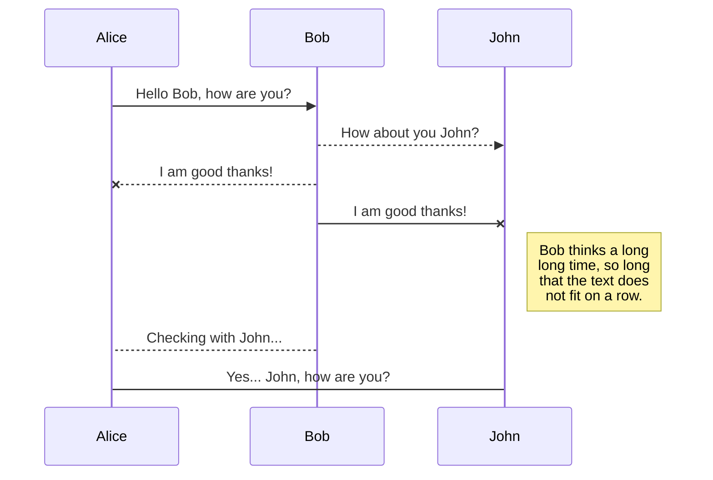
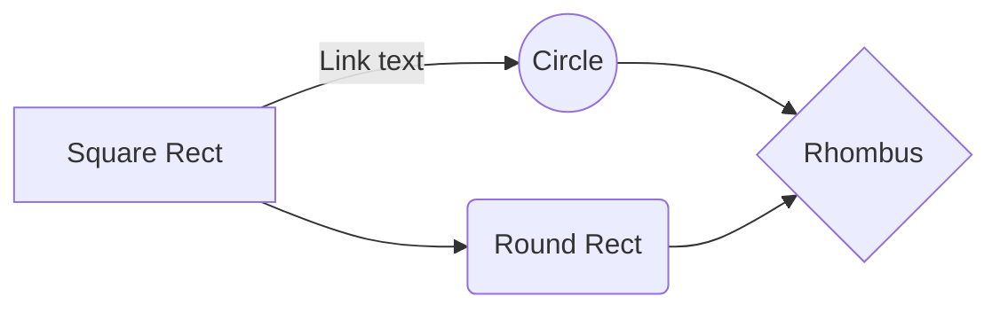

##Tarefa-01

Este repositório foi criado para divulgar os exercícios realizados para a matéria de Estruturas de Linguagens, realizada em 2019/2 pelo professor Francisco Santanna, na Universidade Federal do Rio de Janeiro. 

E como primeira tarefa foi criado o repositório e recomendado o estudo do Markdown.

#Markdown

Em uma rápida busca na **Wikipedia** encontrei que: 

>Markdown é uma linguagem simples de marcação originalmente criada por John Gruber[1] e Aaron Swartz.[2] Markdown converte seu texto em HTML válido.

Que basicamente é trazer alguns aspectos do HTML para o texto simples (plain text), com isso trazendo algumas possibilidades de destaque, com marcações simples.

* Alguns exemplos:
/* = Italico
/ ** Negrito 
/> = Bloco de citação
/# = titulo
/' = código
/* = bullet
/1. = lista
/================== = cabeçalho primeiro nivel
/------------------ = cabeçalho segundo nível
/[Texto do link aqui](endereço.do.link.aqui "título do link aqui") = Links
/ = manges

Além desses possui alguns outros recursos mais complexos como:

* Tabelas
| Col 1 | Col 2 | Col 3 |
|-----------------------|
| Linha 1| Linha 2| Linha 3|
|Ultima 1| Ultima 2| Ultima 3|

* Expressoes matemáticas latex
$$
\Gamma(z) = \int_0^\infty t^{z-1}e^{-t}dt\,.
$$

* Diagramas UML

* Fluxogramas

[Fonte](https://stackedit.io/app#)

#Aplicativo

Durante a pesquisa encontrei o site: https://stackedit.io/app#, que é um bom editor de Markdown e foi utilizado em partes para produzir este primeiro documento. 
